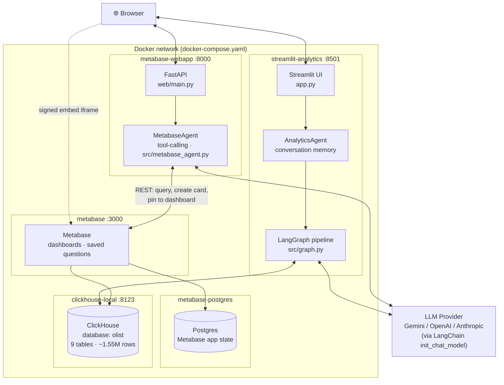
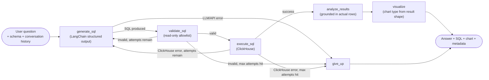
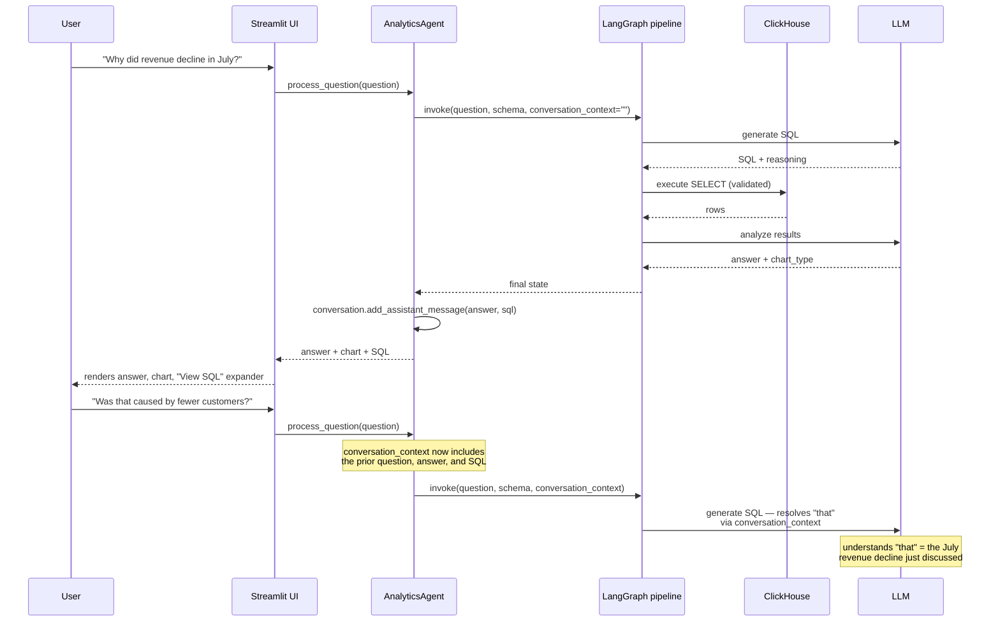
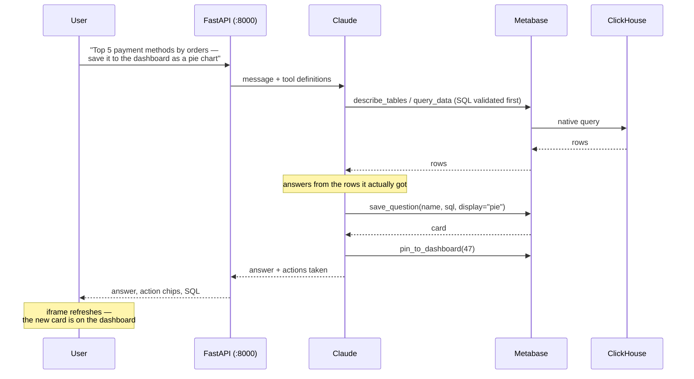
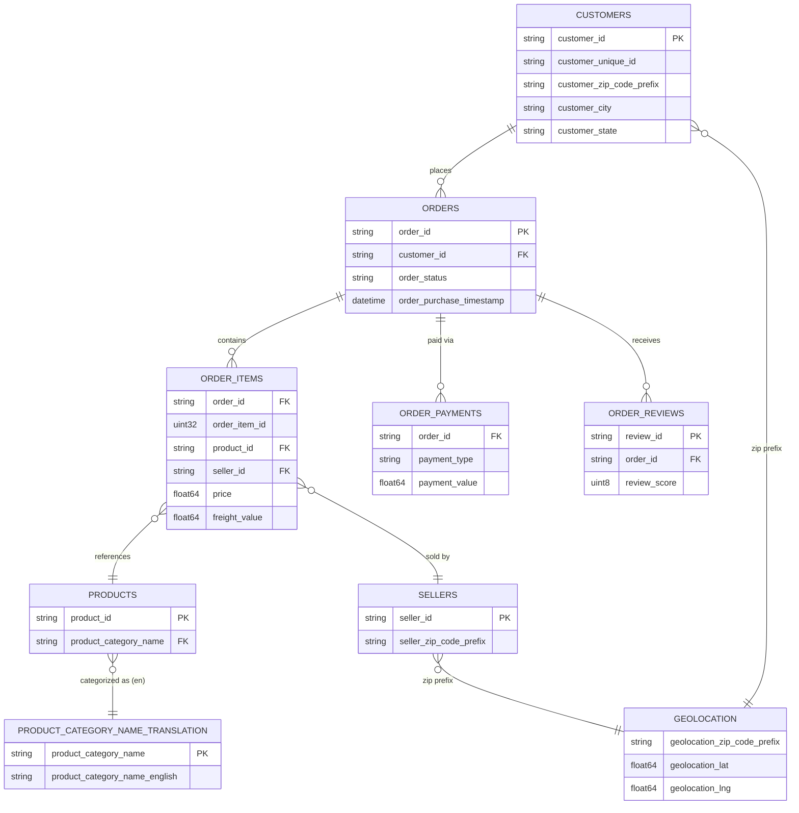

# AI Conversational Analytics over ClickHouse

Ask questions about a real e-commerce dataset in plain English and get back
a grounded, data-backed answer — with the generated SQL, execution metadata,
and a chart, all visible for inspection. Built as a schema-aware,
self-correcting pipeline (not a thin "prompt-to-SQL" wrapper) using
**LangChain** + **LangGraph** on top of an existing **ClickHouse** database.

```
"Which product category generates the most revenue?"
→ discovers the schema → generates ClickHouse SQL → validates it's read-only
→ executes it → interprets the actual rows returned → answers + charts it
```

## Two front ends, one pipeline

The same safety-gated SQL layer backs two different UIs, so you can compare
approaches to conversational BI side by side:

| | **Streamlit** · [:8501](http://localhost:8501) | **Metabase + Claude** · [:8000](http://localhost:8000) |
|---|---|---|
| Charts rendered by | Plotly, in-process | Metabase |
| Answers are | ephemeral, per-session | persistable as real Metabase questions |
| Claude can | answer and chart | answer, **and build dashboards** |
| Best for | exploring a question | shipping something the team keeps |

The Metabase UI is the interesting one: Claude doesn't just query — it has
tools to **create saved questions and pin them to dashboards**, so "show me
review scores by category and add it to the dashboard" leaves behind real
Metabase content that outlives the chat. Metabase itself stays available at
[:3000](http://localhost:3000) for anyone who wants to drill in by hand.

## Why this isn't just "question → SQL → answer"

Most LLM-SQL demos skip straight from a question to a query. This project
treats each stage as a distinct, inspectable step — schema retrieval, SQL
generation, validation, execution, result analysis, and visualization — and
implements the SQL generate/validate/execute loop as an explicit
**LangGraph state machine** with bounded retries, so a bad query gets fed
back to the LLM as correction context instead of crashing or looping forever.

## Quick start (fresh machine)

Requires Docker + Docker Compose and a (free) Kaggle account — the dataset
is downloaded through Kaggle's own API under your account rather than
committed to this repo (see [Dataset &amp; license](#dataset--license) for why).
If you don't have Kaggle API access set up yet, do that first:
[Setting up Kaggle API access](#setting-up-kaggle-api-access).

```bash
git clone https://github.com/giovanniabel/bi-ai.git bi-conversation-analytics-ecommerce
cd bi-conversation-analytics-ecommerce

cp ai-analytics/.env.example ai-analytics/.env
# edit ai-analytics/.env: set LLM_API_KEY (and LLM_PROVIDER/LLM_MODEL if not using Gemini)

./scripts/download_dataset.sh

docker compose up -d
```

That brings up four things:

| URL | What it is |
|---|---|
| **http://localhost:8000** | Claude chat + embedded Metabase dashboards |
| **http://localhost:8501** | Streamlit conversational analytics |
| **http://localhost:3000** | Metabase itself (`admin@example.com` / `metabase123!`) |
| http://localhost:8123 | ClickHouse HTTP |

On first startup, ClickHouse automatically:

1. Creates the `olist` database and its 9 tables
2. Loads the full [Olist Brazilian e-commerce dataset](https://www.kaggle.com/datasets/olistbr/brazilian-ecommerce)
   (~1.55M rows) from the CSVs `download_dataset.sh` just placed in [`data/olist/`](data/olist)

…and the web app provisions Metabase (connection + starter dashboard) the
first time it can reach it. Both steps are idempotent and only do real work
once — see [Automatic data provisioning](#automatic-data-provisioning) and
[Zero-click Metabase setup](#zero-click-metabase-setup).

Give it a couple of minutes on a cold start: ~30–60s for the ClickHouse load,
and Metabase's own first boot (schema migrations) is the slowest part. The
web app shows "Metabase starting…" until it's ready rather than erroring out.

### Setting up Kaggle API access

One-time setup, needed before `./scripts/download_dataset.sh` will work.
Credentials go in `ai-analytics/.env` alongside the rest of this project's
config — one file to fill in, no separate `~/.kaggle/kaggle.json`.

1. **Create a free Kaggle account**, if you don't already have one, at
   https://www.kaggle.com/account/login.
2. **Install the Kaggle CLI**: `pip install kaggle` (or `uv tool install kaggle` /
   `pipx install kaggle`).
3. **Create an API token**: go to https://www.kaggle.com/settings, scroll to
   the **API** section, and click **Create New Token**. Kaggle shows your
   username and the generated key on screen — copy both. (Older Kaggle
   accounts may instead get a `kaggle.json` download containing the same
   two values — either way, you just need the username and key.)
4. **Put them in `ai-analytics/.env`**:
   ```env
   KAGGLE_USERNAME=your-username
   KAGGLE_KEY=your-key
   ```

   `scripts/download_dataset.sh` reads these from that file automatically.
   If you'd rather not store them there, exporting `KAGGLE_USERNAME`/
   `KAGGLE_KEY` in your shell works too and takes precedence over the file.
5. **Run the download**: `./scripts/download_dataset.sh`. If it fails with
   a 403/"forbidden" error, open the
   [dataset page](https://www.kaggle.com/datasets/olistbr/brazilian-ecommerce)
   in a browser while logged in and click through any rules/terms prompt —
   Kaggle sometimes requires accepting a dataset's terms via the web UI once
   before the API will serve it to your account.

Your Kaggle key is a credential like `LLM_API_KEY` — `ai-analytics/.env` is
already gitignored, so it never gets committed alongside `ai-analytics/.env.example`.

## Architecture



Nothing outside [`src/llm.py`](ai-analytics/src/llm.py) imports a
provider-specific SDK — switching `LLM_PROVIDER` is a two-variable env change.

Both UIs ship in **one image**: the Dockerfile's default command runs
Streamlit, and the `metabase-webapp` service overrides `command` to run
uvicorn instead. They share `src/`, so the SQL safety gate and the LLM
factory exist once, not twice.

### The LangGraph pipeline



Every retry re-enters `validate_sql` — a corrected query can never reach
`execute_sql` by skipping the safety gate. Retries are capped by
`MAX_SQL_RETRY_ATTEMPTS` (default 3); see [`tests/test_graph.py`](ai-analytics/tests/test_graph.py)
for tests that pin down exactly this behavior with fake LLM/ClickHouse stubs.

### Conversational follow-ups



[`src/conversation.py`](ai-analytics/src/conversation.py) keeps a sliding
window of the last `MAX_CONVERSATION_HISTORY` turns (question, answer, and
the SQL used) — enough for follow-ups like "that", "compare it with 2024",
or "show me that by region" to resolve, without sending the entire chat
history to the LLM on every turn.

## Claude ↔ Metabase

The second UI swaps the fixed pipeline for a **tool-calling agent**
([`src/metabase_agent.py`](ai-analytics/src/metabase_agent.py)). Instead of
one hard-coded path, Claude decides which tools to call and in what order —
which is what lets a single sentence both answer a question *and* leave
behind a dashboard card.

| Tool | What Claude can do with it |
|---|---|
| `describe_tables` | Read the live ClickHouse schema before writing SQL |
| `query_data` | Run a **validated** read-only query through Metabase |
| `list_dashboards` / `list_saved_questions` | See what already exists |
| `save_question` | Persist a query as a Metabase card, with a chart type |
| `create_dashboard` | Start a new dashboard |
| `pin_to_dashboard` | Add a saved question to a dashboard |



**The safety gate still applies.** Every SQL string the model produces —
whether to answer or to save — goes through the same
[`SQLValidator`](ai-analytics/src/sql_validator.py) the Streamlit pipeline
uses. A rejected query never reaches Metabase, which matters here because
Metabase's own ClickHouse connection *could* write; the allowlist is what
guarantees it doesn't.

### Zero-click Metabase setup

[`src/metabase_provision.py`](ai-analytics/src/metabase_provision.py) takes a
blank Metabase to a working state on first boot — no setup wizard, no
clicking through a connection form:

1. Completes the first-run setup (creates the admin user)
2. Registers ClickHouse as a data source
3. Enables signed embedding and reads back the secret
4. Builds the **Sales Overview** dashboard — KPI scalars, an orders-per-month
   trend, top seller cities, top categories by revenue

Every step checks for its own result first, so it's safe to re-run; a second
pass logs `created_setup=false created_database=false created_dashboard=false`
and changes nothing.

The embedding secret deserves a note: `MB_EMBEDDING_SECRET_KEY` is
deliberately **not** set in compose. A Metabase setting fixed by an env var
becomes read-only over the API, so leaving it unset lets the app read
Metabase's own generated secret back and sign embed JWTs with it — signed
embedding works with zero configuration, and there's no shared secret to keep
in sync across two files.

## The dataset

[Olist](https://www.kaggle.com/datasets/olistbr/brazilian-ecommerce), a
Brazilian e-commerce marketplace dataset: ~99K orders, ~1.55M rows total
across 9 tables.



None of this is hard-coded in the app — [`src/schema_inspector.py`](ai-analytics/src/schema_inspector.py)
discovers tables, columns, types, row counts, and infers these relationships
(via `system.tables`/`system.columns` and shared foreign-key-shaped column
names) at runtime, so the app works against whatever tables actually exist.

## Automatic data provisioning

Two separate steps, deliberately kept apart:

1. **Getting the CSVs onto your machine** — [`scripts/download_dataset.sh`](scripts/download_dataset.sh)
   pulls the dataset from Kaggle via the official `kaggle` CLI, authenticated
   with *your own* Kaggle account, into `data/olist/` (gitignored — nothing
   downloaded here is ever committed to this repo). See
   [Dataset &amp; license](#dataset--license) for why it's fetched this way
   instead of being bundled in the repo.
2. **Loading those CSVs into ClickHouse** — `docker-compose.yaml` mounts
   [`clickhouse/init/01-load-olist-data.sh`](clickhouse/init/01-load-olist-data.sh)
   into `/docker-entrypoint-initdb.d/` and `data/olist/` into `/olist-data/`.
   ClickHouse's official image runs everything in `docker-entrypoint-initdb.d/`
   **only when its data volume is empty** — i.e. the very first time the
   stack starts on a machine. The script creates the `olist` database/tables
   and streams each CSV straight into ClickHouse via `clickhouse-client`. On
   any later `docker compose up` (existing volume, existing data) this step
   is skipped entirely — verified by restarting the container and confirming
   row counts stay exactly the same rather than doubling. **The existing
   ClickHouse data on this machine is never touched, reloaded, or
   overwritten by this mechanism.** If the CSVs aren't there yet (step 1
   skipped), the script fails fast with a message pointing you at
   `download_dataset.sh` instead of a cryptic ClickHouse error.

If you'd rather load data manually against an already-running container,
[`load_data.sh`](load_data.sh) at the repo root does the same thing via
`docker exec` (also reading from `data/olist/`).

## Dataset & license

[Brazilian E-Commerce Public Dataset by Olist](https://www.kaggle.com/datasets/olistbr/brazilian-ecommerce),
licensed **CC BY-NC-SA 4.0** (Attribution, NonCommercial, ShareAlike) by
Olist. That license permits non-commercial redistribution with attribution,
but Kaggle-hosted datasets are conventionally *not* re-hosted inside git
repos — instead, `scripts/download_dataset.sh` fetches it through the
official Kaggle API under your own account, so you're pulling the data
directly from its source under your own credentials rather than this repo
redistributing a copy. The data's license is independent of whatever
license the application code carries.

## Features

- **Dynamic schema discovery** — no hard-coded columns; reads `system.tables`/`system.columns` live
- **Schema-aware SQL generation** — LangChain structured output, ClickHouse dialect, joins based on inferred relationships
- **Allowlist SQL validation** — only `SELECT`/`WITH` pass; a fixed set of destructive/DDL keywords is rejected even mid-query; CTEs handled correctly; multi-statement injection blocked
- **Self-correcting execution** — validation/execution errors feed back into the next generation attempt, capped by `MAX_SQL_RETRY_ATTEMPTS`
- **Result analysis grounded in real data** — no invented statistics; distinguishes observed facts from inferences
- **Automatic visualization** — line/bar/horizontal-bar/scatter/pie/metric/table, chosen from the actual result shape, never forced
- **Conversational memory** — sliding-window context resolves "that", "the previous month", "compare it", etc.
- **Full query transparency** — every answer has an expandable "View SQL" panel plus execution time and row count
- **Structured logging** — question, generated SQL, validation result, timings, row counts, errors (no secrets)

## Tech stack

| Layer                 | Choice                                                                  |
| --------------------- | ----------------------------------------------------------------------- |
| UI 1                  | Streamlit                                                               |
| UI 2                  | FastAPI + vanilla JS, with Metabase embedded via signed JWT iframes      |
| BI / dashboards       | Metabase (ClickHouse driver bundled since v54), Postgres for its app DB  |
| Orchestration         | LangGraph — `StateGraph` for the pipeline, `create_react_agent` for tools |
| LLM interface         | LangChain (`init_chat_model`, structured output) — provider-agnostic |
| Database              | ClickHouse (existing instance, read-only access)                        |
| DB client             | `clickhouse-connect`                                                  |
| Data handling         | pandas                                                                  |
| Charts                | Plotly (Streamlit UI) · Metabase (web UI)                               |
| Dependency management | [uv](https://docs.astral.sh/uv/) (`pyproject.toml` + `uv.lock`)      |

## Project layout

```
bi-conversation-analytics-ecommerce/
├── docker-compose.yaml        # ClickHouse + Metabase + Postgres + both UIs
├── scripts/
│   └── download_dataset.sh    # pulls the dataset from Kaggle (not committed)
├── clickhouse/init/           # runs once, on a fresh ClickHouse volume
│   └── 01-load-olist-data.sh
├── data/olist/                # dataset CSVs land here (gitignored except README.md)
├── load_data.sh               # manual/alternative loader (docker exec-based)
└── ai-analytics/              # one image, two UIs
    ├── app.py                 # UI 1: Streamlit
    ├── web/                   # UI 2: FastAPI + Metabase
    │   ├── main.py               # API: /api/chat, /api/embed/..., /api/status
    │   └── static/               # chat + embedded-dashboard front end
    ├── pyproject.toml / uv.lock
    ├── Dockerfile
    ├── src/                   # shared by both UIs
    │   ├── config.py             # env-driven configuration
    │   ├── clickhouse_client.py  # read-only ClickHouse client + QueryResult
    │   ├── schema_inspector.py   # dynamic schema discovery
    │   ├── llm.py                # LangChain chat-model factory (provider swap point)
    │   ├── sql_generator.py      # LLM SQL generation (structured output)
    │   ├── sql_validator.py      # allowlist-based read-only SQL safety gate
    │   ├── graph.py              # LangGraph StateGraph: pipeline + retries
    │   ├── analytics_agent.py    # orchestrator: conversation + graph invocation
    │   ├── result_analyzer.py    # LLM result interpretation, grounded in data
    │   ├── visualization.py      # Plotly chart selection from result shape
    │   ├── conversation.py       # sliding-window conversation memory
    │   ├── metabase_client.py    # Metabase REST API client
    │   ├── metabase_provision.py # idempotent first-boot Metabase setup
    │   ├── metabase_agent.py     # Claude tool-calling agent over Metabase
    │   └── metabase_embed.py     # signed (JWT) embed URLs
    ├── prompts/                  # system prompts for SQL generation / analysis
    └── tests/
        ├── test_sql_validator.py   # safety-critical: allowlist behavior
        ├── test_graph.py           # pipeline routing/retry behavior
        ├── test_metabase_client.py # dashcard stacking, result normalization
        ├── test_metabase_agent.py  # tool safety: writes never reach Metabase
        └── test_metabase_embed.py  # embed JWT claims + no-secret fallback
```

See [`ai-analytics/README.md`](ai-analytics/README.md) for app-level dev
setup (running outside Docker, switching LLM providers, running tests).

## Configuration

All configuration is environment-driven via `ai-analytics/.env`
(copy from `.env.example` — never commit `.env`, it's gitignored).

| Variable                                              | Purpose                                                                                    |
| ----------------------------------------------------- | ------------------------------------------------------------------------------------------ |
| `CLICKHOUSE_HOST`                                   | `localhost` on your host machine, `clickhouse` inside the Docker network               |
| `CLICKHOUSE_HTTP_PORT` / `CLICKHOUSE_NATIVE_PORT` | `8123` / `9000`                                                                        |
| `CLICKHOUSE_USER` / `CLICKHOUSE_PASSWORD`         | must match the running ClickHouse container                                                |
| `CLICKHOUSE_DATABASE`                               | `olist`                                                                                  |
| `LLM_PROVIDER`                                      | `gemini` \| `openai` \| `anthropic`                                                  |
| `LLM_API_KEY`                                       | key for the selected provider                                                              |
| `LLM_MODEL`                                         | e.g.`gemini-2.5-flash`, `gpt-4o-mini`, `claude-haiku-4-5`                            |
| `MAX_SQL_RETRY_ATTEMPTS`                            | bounds the generate→validate→execute retry loop (default 3)                              |
| `MAX_CONVERSATION_HISTORY`                          | sliding-window size for follow-up context (default 10)                                     |
| `MAX_RESULT_ROWS_FOR_LLM`                           | result rows sent to the LLM before falling back to head/tail + summary stats (default 200) |
| `METABASE_INTERNAL_URL`                             | how the backend reaches Metabase (compose overrides to `http://metabase:3000`)           |
| `METABASE_PUBLIC_URL`                               | how the **browser** reaches Metabase — this is what iframe `src` uses                  |
| `METABASE_ADMIN_EMAIL` / `METABASE_ADMIN_PASSWORD`| admin account created on first boot, and used for all API calls                            |
| `METABASE_CLICKHOUSE_HOST`                          | ClickHouse hostname from *Metabase's* vantage point (default `clickhouse`)              |
| `METABASE_DASHBOARD_NAME`                           | the auto-provisioned dashboard (default `Sales Overview`)                                |
| `METABASE_EMBEDDING_SECRET`                         | optional — blank means "read Metabase's own secret", which is what you usually want      |

Two of these are easy to get wrong, so they're worth calling out:

- **`METABASE_INTERNAL_URL` vs `METABASE_PUBLIC_URL`** — server-to-server
  calls go over the Docker network (`metabase:3000`), but an iframe is loaded
  by the *browser*, which can only resolve `localhost:3000`. Same class of
  problem as `CLICKHOUSE_HOST`.
- **`environment:` beats `env_file:` in Compose.** Only genuinely
  container-specific values (`CLICKHOUSE_HOST`, `METABASE_INTERNAL_URL`) are
  set in `environment:`. Putting a user-tunable key there would silently make
  `ai-analytics/.env` a no-op for it.

## Safety model

[`src/sql_validator.py`](ai-analytics/src/sql_validator.py) uses an
**allowlist**, not a keyword blocklist:

- Only `SELECT` / `WITH ... SELECT` statements pass.
- `DROP`, `TRUNCATE`, `DELETE`, `ALTER`, `INSERT`, `UPDATE`, `CREATE`,
  `ATTACH`, `DETACH`, `OPTIMIZE`, `GRANT`, `REVOKE`, and more are rejected
  as standalone keywords, even inside otherwise-valid-looking SQL (word-boundary
  matching means `delete_count` as a column alias is fine — only the actual
  keyword is blocked).
- Multiple `;`-separated statements are rejected.
- Every referenced table (CTEs excluded from the check) must exist in the
  schema the inspector actually discovered — no hallucinated tables.

The same gate covers **both** UIs. In the Metabase agent it's load-bearing in
a way worth spelling out: Metabase connects to ClickHouse with credentials
that *can* write, and the agent can create saved questions whose SQL runs
later. So `query_data` and `save_question` both validate before anything
reaches Metabase — a rejected query is never executed and never persisted as
a card. [`tests/test_metabase_agent.py`](ai-analytics/tests/test_metabase_agent.py)
pins this down by asserting the fake Metabase client records *zero* calls for
`DROP`/`DELETE`/`INSERT`/`UPDATE`/multi-statement input.

## Running tests

```bash
cd ai-analytics
uv run pytest tests/ -v
```

38 tests: SQL validator safety cases + LangGraph pipeline retry/give-up
behavior driven with fake LLM/ClickHouse stubs (no live services needed).
